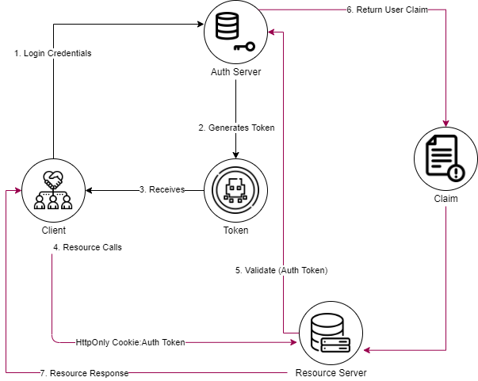
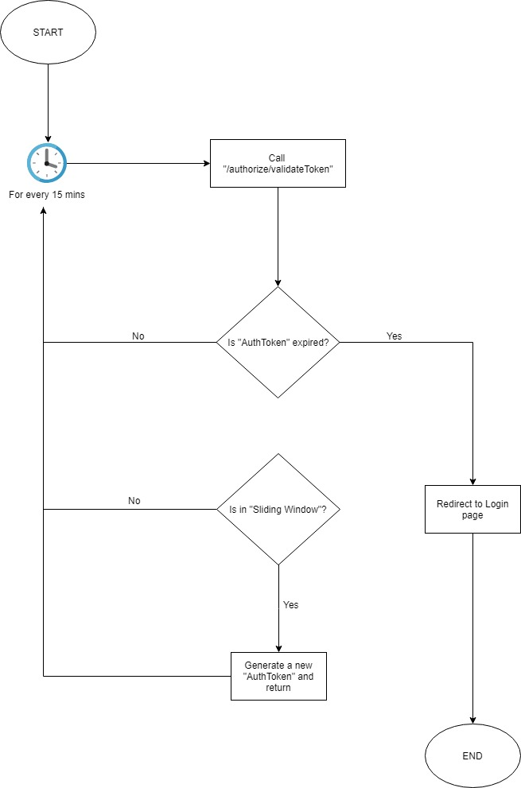
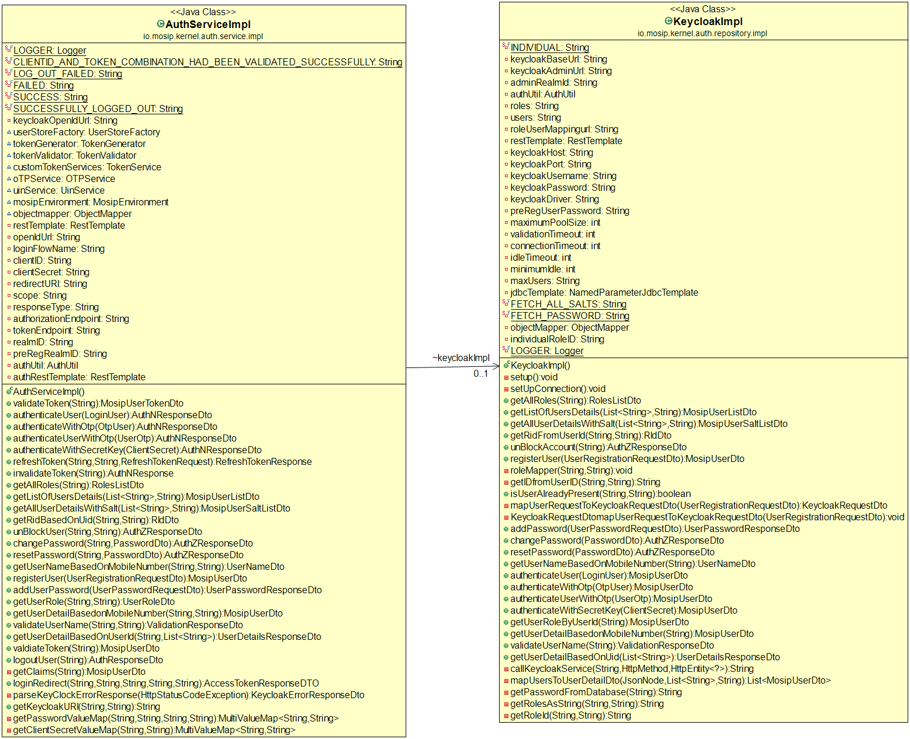

# AuthManager #

## Overview ##

MOSIP AuthManager is a multi-factor authentication solution that verifies authentication requests and centrally administers authentication policies for enterprise networks.

The AuthManager provides an easy way to manage user authentication (logging in and out) and authorization (keeping track of tokens, sessions, and groups) for MOSIP users. The AuthManager is most useful for MOSIP team with an access level of Authenticated. These are accessed by end users who are members/enrolled with MOSIP.

### Key Concept ###

The MOSIP platform handles authentication and authorization in a centralized location. The standards are based on the OAuth 2.0 authorisation framework, with JSON Web Token (JWT) serving as a means for implementing the framework.

*	A centralized AUTH SERVER (Auth Service with an IAM example Keycloak) handles the authorization request from the platform
*	Once authenticated, the Auth Server sends back an AuthToken
*	Auth token contains the information about the authenticated user and the meta data such as the expiration time, subject, issuer etc.
*	The Tokens are stored in the IAM for an individual user. In case of force logout scenario, this record will be deleted from this datastore

### Epicenter Channel Manager ###

The Epicenter platform provides a push channel, which allows you to publish and subscribe to messages within MOSIP:

*	No resource in the MOSIP can be accessed without Authentication and Authorization
*	All the auth requests will go via the Auth Server
*	The user data stores are abstracted behind the IAM
*	The user data stores should be pluggable(If supported by configured IAM)
*	The platform's authentication method should support the heterogenous technologies and authentication should happen seamlessly

## AuthManager Process Flow ##

### Actors in MOSIP Platform ###

The actors in the authentication process are listed below:
1. Human Users

*	These are the actual human users
*	Users are provided a Username and Password

2. Clients

*	These are the applications like Registration client, IDA etc
*	Applications are provided with client_credentials like clientid & secret-key

## Authentication and Authorization Principles ##

*	No resource in the MOSIP can be accessed without Authentication and Authorization
*	All the auth requests will go via the Auth Server
*	The user data stores are abstracted behind the IAM
*	The user data stores should be pluggable(If supported by configured IAM)
*	The platform's authentication method should support the heterogenous technologies and authentication should happen seamlessly

## Implementation of Auth in Different Platform ##

### Web Services ##

An Auth Adapter component is supplied to Web service developers to assist the development effort. To install the Auth Adapter, the developer must follow three steps:

*	Include the Auth Adapter jar file in the classpath
*	Inject the Auth Server details
*	Annotate the server method which have to be protected with the "Role" information

### JavaFX Application ###

*	Pass the username and password to the Auth server if a real human user logs in.
*	Pass the clientid and secret-key in case of background services.
*	The client obtains the Auth Token after being authenticated. The client keeps them in a safe local location.
*	In all the REST service calls to server, include the Auth Token
*	If the Auth token is expired, login again

### Angular Application ###

*	The human user logs in using the username and the password
*	The client obtains the Auth Token after being authenticated. They are saved by the client in an HTTP-only cookie.
*	In all the REST service calls to server, Auth Token is included
*	If the Auth Token is expired, the page is redirected to the login page
*	On the client side, a timer runs that is shorter than the session timeout. The "/authorize/validateToken" service is called by this timer
*	A new Auth Token will be given if the Auth Token enters the Sliding Window Threshold

## Realms in Keycloak-MOSIP ##

*	Pre-Registration -preregistration
*	Registration - mosip
*	Registration processor - mosip
*	IDA - mosip
*	Partner Management - partnermanagement

## Pluggable IAM with Auth Service ##

*	Auth Service communicates with any plugable IAM with OPENID Endpoints
*	All the features like token storage,user details storage, sessions etc are handled by IAM
*	In case supported by IAM Auth Service will connect with different realms and do AUTHN and AUTHZ smoothly

## Class Diagram ##

